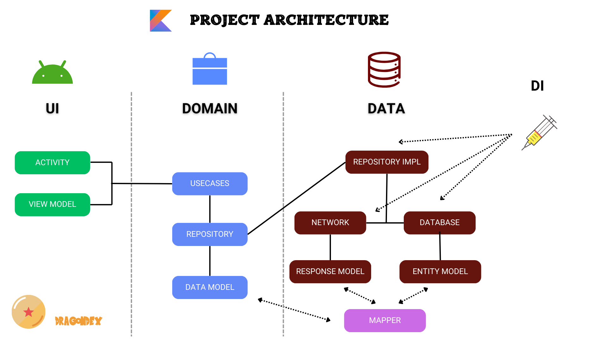

<h1 align="center">DragonDex</h1>

  
  

  🔥 DragonDex is a modern Android development project developed with Hilt, Coroutines, Flow, Jetpack (Room, ViewModel) based on MVVM architecture.

  

## Download
Go to the [Releases](https://github.com/skydoves/pokedex-compose/releases) to download the latest APK.

## Tech stack & Open-source libraries
- Minimum SDK level 21.
- [Kotlin](https://kotlinlang.org/) based, utilizing [Coroutines](https://github.com/Kotlin/kotlinx.coroutines) + [Flow](https://kotlin.github.io/kotlinx.coroutines/kotlinx-coroutines-core/kotlinx.coroutines.flow/) for asynchronous operations.
- Jetpack Libraries:
    - Jetpack Compose: Android’s modern toolkit for declarative UI development.
    - Lifecycle: Observes Android lifecycles and manages UI states upon lifecycle changes.
    - ViewModel: Manages UI-related data and is lifecycle-aware, ensuring data survival through configuration changes.
    - Navigation: Facilitates screen navigation, complemented by [Hilt Navigation Compose](https://developer.android.com/jetpack/compose/libraries#hilt) for dependency injection.
    - Room: Constructs a database with an SQLite abstraction layer for seamless database access.
    - [Hilt](https://dagger.dev/hilt/): Facilitates dependency injection.
- Architecture:
    - MVVM Architecture (View - ViewModel - Model): Facilitates separation of concerns and promotes maintainability.
    - Repository Pattern: Acts as a mediator between different data sources and the application's business logic.
- [Retrofit2 & OkHttp3](https://github.com/square/retrofit): Constructs REST APIs and facilitates paging network data retrieval.
- [ksp](https://github.com/google/ksp): Kotlin Symbol Processing API for code generation and analysis.
- [Lottie](https://github.com/airbnb/lottie-android): Render After Effects animations natively on Android and iOS.

  

## Architecture
DragonDex is based on MVVM architecture:

  

The architecture of this repository is structured in 4 main layers:
- UI: Contains UI-related classes such as Activities.
- Domain: Contains UseCases, Repositories, and Models -> Business logic.
- Data: Contains Repository implementations and data sources. -> Provides the data.
- DI: Contains dependency injection modules.

## Open API

DragonDex using the [dragonball-api](https://web.dragonball-api.com/) for constructing RESTful API. 

## Find this repository useful? :heart:
Support it by joining __[stargazers](https://github.com/sgaleraalq/DragonDex/stargazers)__ for this repository. :star:  
Also, __[follow me](https://github.com/sgaleraalq)__ on GitHub for my next creations! 🤩
